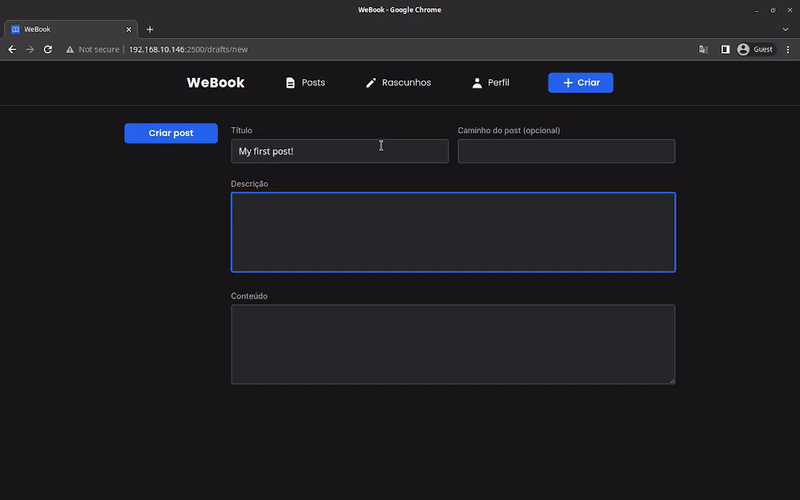

# WeBook

## 📄 Overview

WeBook is an open-source blog that focuses on creating posts in a collaborative and open way, where anyone can create a post and invite other users to contribute.



[See full overview in video format](https://res.cloudinary.com/dpkgd6rhb/video/upload/v1652395122/github/we-book/we-book-web-overview_g5swet.mp4)

The app is available in the brazilian portuguese :brazil: language. Support for the english language :us: isn't planned.

## 🏭 Technologies

### Turborepo

Turborepo is a high-performance build system for JavaScript and TypeScript codebases. (Source: Turborepo)

[Official website](https://turborepo.org)

### Nginx

Nginx is an HTTP and reverse proxy server, a mail proxy server and a generic TCP/UDP proxy server. (Source: Nginx)

[Official website](https://nginx.org/en/)

### RabbitMQ

RabbitMQ is an open-source message-broker software. (Source: RabbitMQ)

Used in this project for:

- Communication between services.

[Official website](https://www.rabbitmq.com/)

### Docker

Docker enables you to separate your applications from your infrastructure so you can deliver software quickly. (Source: Docker)

Used in this project for:

- Locally run the infra layer (Postgres) with [docker-compose](https://docs.docker.com/compose/) using fast commands and a simple configuration

[Official website](https://docker.com)

## 🧪 Additional Tools

### Commitlint

Commitlint helps your team adhering to a commit convention. By supporting npm-installed configurations it makes sharing of commit conventions easy. (Source: Commitlint)

[Official website](https://commitlint.js.org)

### Commitizen

Commitizen define a standard way of committing rules and communicating it (using the cli provided by commitizen). (Source: Commitizen)

[Official website](https://commitizen-tools.github.io/commitizen/)

### Lint-staged

Run linters against staged git files and don't let hankey slip into your code base! (Source: Lint-staged)

[Official Github repository](https://github.com/okonet/lint-staged)

### ESLint

ESLint is a tool for identifying and reporting on patterns found in ECMAScript/JavaScript code. (Source: ESLint)

[Official website](https://github.com/eslint/eslint)

### Prettier

Prettier is a code formatter. (Source: Prettier)

[Official website](https://prettier.io)

## 💻 Usage

You can run this monorepo in you local machine by following the [Installation](#construction_worker-installation) guide.

## :construction_worker: Installation

You have to setup each app installation guide (located at the `README.md` file) to run all sub-projects inside this monorepo.

### Running the local containers

You can run local docker containers inside docker-compose by running the following command:

```bash
docker-compose up -d
```

You have to run this command every time you want to start the containers. The containers stop if you shut down your machine

---

**That's it!** Now you can run the project on your local machine. See the [scripts](#scripts) section for all available scripts

## 🏃 Scripts

ct

### build

```bash
yarn build
```

Build all the monorepo projects artifacts for production using [Turborepo CLI](https://nextjs.org/docs/api-reference/cli).

### dev

```bash
yarn dev
```

Start all the monorepo projects with hot-reloading using [Turborepo CLI](https://nextjs.org/docs/api-reference/cli).

### lint

```bash
yarn lint
```

Lint all the monorepo projects code using [Turborepo CLI](https://nextjs.org/docs/api-reference/cli).

### ct

```bash
yarn ct
```

Run [commitizen](#commitizen) cli to make faster and better commits.

This command runs the [lint-staged](#lint-staged) before executing the [commitizen](#commitizen) cli

## :briefcase: License

This project is licensed under the [MIT License](LICENSE)
