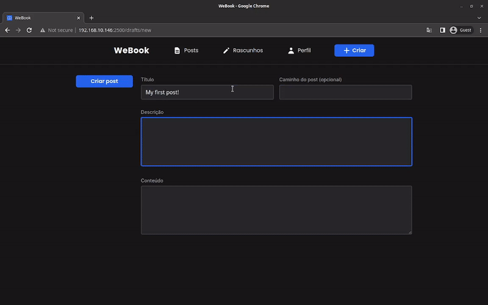

# WeBook - Frontend

## 📄 Overview

WeBook is an open-source blog that focuses on creating posts in a collaborative and open way, where anyone can create a post and invite other users to contribute.

### Frontend



[See full overview in video format](https://res.cloudinary.com/dpkgd6rhb/video/upload/v1652395122/github/we-book/we-book-web-overview_g5swet.mp4)

This the frontend for the WeBook application.

The app is available in the brazilian portuguese :brazil: language. Support for the english language :us: isn't planned.

## 🏭 Technologies

### Next.js

Next.js gives you the best developer experience with all the features you need for production: hybrid static & server rendering, TypeScript support, smart bundling, route pre-fetching, and more. No config needed. (Source: Next.js)

[Official Website](https://nextjs.org/)

### Supertokens

SuperTokens is an open source authentication solution. (Source: Supertokens)

[Official Website](https://supertokens.com)

### Radix UI

An open-source UI component library for building high-quality, accessible design systems and web apps. (Source: Radix UI)

Components used:

- [Toast](https://www.radix-ui.com/docs/primitives/components/toast)
- [Scroll Area](https://www.radix-ui.com/docs/primitives/components/scroll-area)

[Official Website](https://www.radix-ui.com/)

### Zustand

A small, fast and scalable bearbones state-management solution using simplified flux principles. Has a comfy api based on hooks, isn't boilerplatey or opinionated. (Source: Zustand)

[Official Github repository](https://github.com/pmndrs/zustand)

### Heroicons

Beautiful hand-crafted SVG icons, by the makers of Tailwind CSS. (Source: Heroicons)

[Official Website](https://heroicons.com/)

### Remark

Remark is a tool that transforms markdown with plugins. (Source: Remark)

Plugins used:

- [remark-html](https://github.com/remarkjs/remark-html)

Powered by [unified](https://github.com/unifiedjs/unified)

[Official Github repository](https://github.com/remarkjs/remark)

### React Query

Performant and powerful data synchronization for React. (Source: React Query)

[Official Website](https://react-query.tanstack.com/)

### Yup

Yup is a schema builder for runtime value parsing and validation. (Source: Yup)

[Official Github repository](https://github.com/jquense/yup)

### Tailwind CSS

Rapidly build modern websites without ever leaving your HTML. (Source: Tailwind CSS)

Tailwind requires the use of the [postscss](https://postcss.org/)

[Official Website](https://tailwindcss.com/)

## 🧪 Additional Tools

### ESLint

ESLint is a tool for identifying and reporting on patterns found in ECMAScript/JavaScript code. (Source: ESLint)

[Official website](https://github.com/eslint/eslint)

### Prettier

Prettier is a code formatter. (Source: Prettier)

[Official website](https://prettier.io)

## 💻 Usage

You can run this site in you local machine by following the [Installation](#construction_worker-installation) guide.

## :construction_worker: Installation

### Tools

You go need these tools to install this repository on your local machine:

- Git. [Install guide](https://github.com/git-guides/install-git)
- Yarn. [Install guide](https://classic.yarnpkg.com/lang/en/docs/install/#debian-stable)

After you install all these tools up head, you can proceed to the next topic.

### Cloning the Repository:

First of all, clone the repository by running the following command:

```bash
git clone https://github.com/Cauaspinheiro/we-book.git
```

After this, go to the project's folder by running the following command:

```bash
cd we-book
```

### Installing the project's dependencies

You can install the project's dependencies by running the following command inside the project's folder:

```bash
yarn
```

### `.env` - Environment variables

The dotenv file (.env) contains all the environment variables of the project. You can see the variable inside the `.env.example` file.

To configure the `.env`, you can create a new `.env` file and copy all the `.env.example` content inside this file. Then, complete the value of each key with you configuration.

#### Blog API secret key

key: `BLOG_API_SECRET`

The secret key of the blog service.

Must match with the blog service key to be able to communicate

It's used to request posts in [SSG](https://nextjs.org/docs/basic-features/pages#static-generation-recommended).

#### API domain

key: `NEXT_PUBLIC_API_DOMAIN`

The API url to frontend communicate with.

This key is prefixed with `NEXT_PUBLIC_` due to [Next.js security protocols](https://nextjs.org/docs/basic-features/environment-variables#exposing-environment-variables-to-the-browser)

#### Supertokens configuration

keys: `NEXT_PUBLIC_SUPERTOKENS_APP_NAME` - `NEXT_PUBLIC_SUPERTOKENS_WEBSITE_DOMAIN`

The supertokens configuration for this website.

In the respective order:

- The project's app name - "WeBook" is recommended
- The frontend domain

These keys are prefixed with `NEXT_PUBLIC_` due to [Next.js security protocols](https://nextjs.org/docs/basic-features/environment-variables#exposing-environment-variables-to-the-browser)

---

**That's it!** Now you can run the project on your local machine. See the [scripts](#scripts) section for all available scripts

## 🏃 Scripts

### build

```bash
yarn build
```

Build the project artifact for production using [Next.js CLI](https://nextjs.org/docs/api-reference/cli).

### start

```bash
yarn start
```

Run the build artifact with [Next.js CLI](https://nextjs.org/docs/api-reference/cli).

You have to run the `build` command before you run this command to work.

### dev

```bash
yarn dev
```

Start the project with hot-reloading using [Next.js CLI](https://nextjs.org/docs/api-reference/cli).

### lint

```bash
yarn lint
```

Lint the project code using [Next.js CLI](https://nextjs.org/docs/api-reference/cli).
