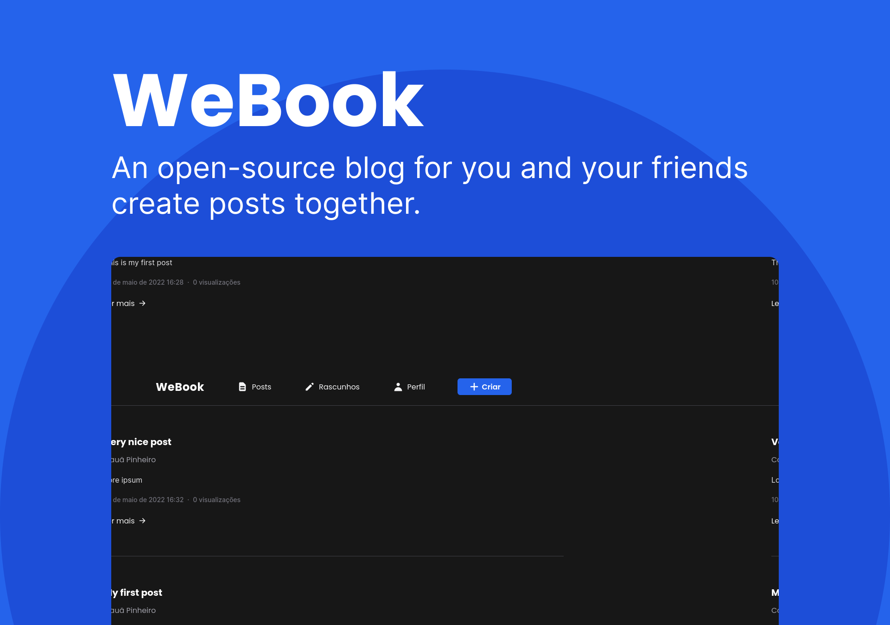
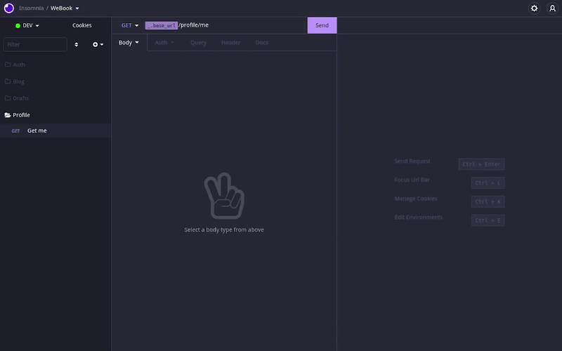

# WeBook - Profile service

## 📄 Overview

WeBook is an open-source blog that focuses on creating posts in a collaborative and open way, where anyone can create a post and invite other users to contribute.

### Profile service



[See in video format](https://res.cloudinary.com/dpkgd6rhb/video/upload/v1652308722/github/we-book/we-book-profile-service-overview_pcqasu.mp4)

This service is responsible for managing the blog profiles.

Here you can see your profile data, like the total posts that you have ever published.

## 🏭 Technologies

### NestJS

NestJS is a progressive Node.js framework for building efficient, reliable and scalable server-side applications. (Source: NestJS)

[Official website](https://nestjs.com/)

### Prisma

Next-generation Node.js and TypeScript ORM (Source: Prisma)

[See more](https://www.prisma.io)

### RabbitMQ

RabbitMQ is an open-source message-broker software. (Source: RabbitMQ)

Used in this project for:

- Communication with other services.

[Official website](https://www.rabbitmq.com/)

## 🧪 Additional Tools

### Docker

Docker enables you to separate your applications from your infrastructure so you can deliver software quickly. (Source: Docker)

Used in this project for:

- Locally run the infra layer (Postgres) with [docker-compose](https://docs.docker.com/compose/) using fast commands and a simple configuration

[Official website](https://docker.com)

### ESLint

ESLint is a tool for identifying and reporting on patterns found in ECMAScript/JavaScript code. (Source: ESLint)

[Official website](https://github.com/eslint/eslint)

### Prettier

Prettier is a code formatter. (Source: Prettier)

[Official website](https://prettier.io)

## 💻 Usage

You can run this API in you local machine by following the [Installation](#construction_worker-installation) guide.

You can download the API endpoints collection by clicking in the button below:

[]()

## :construction_worker: Installation

### Tools

You go need these tools to install this repository on your local machine:

- Docker & Docker Compose. [Install guide](https://docs.docker.com/engine/install/)
- Git. [Install guide](https://github.com/git-guides/install-git)
- Yarn. [Install guide](https://classic.yarnpkg.com/lang/en/docs/install/#debian-stable)

After you install all these tools up head, you can proceed to the next topic.

### Cloning the Repository:

First of all, clone the repository by running the following command:

```bash
git clone https://github.com/Cauaspinheiro/we-book.git
```

After this, go to the project's folder by running the following command:

```bash
cd we-book
```

### Installing the project's dependencies

You can install the project's dependencies by running the following command inside the project's folder:

```bash
yarn
```

### Running the local containers

You can run local docker containers inside docker-compose by running the following command inside the service folder (/services/profile):

```bash
docker-compose up -d
```

You have to run this command every time you want to start the containers. The containers stop if you shut down your machine

### `.env` - Environment variables

The dotenv file (.env) contains all the environment variables of the project. You can see the variable inside the `.env.example` file.

To configure the `.env`, you can create a new `.env` file and copy all the `.env.example` content inside this file. Then, complete the value of each key with you configuration.

#### Database URL

key: `DATABASE_URL`

The [postgres connection string](https://www.postgresql.org/docs/current/libpq-connect.html#LIBPQ-CONNSTRING) to the database

#### Auth API secret key

keys: `AUTH_SERVICE_API_SECRET`

The secret key for the auth service.

Must match with the auth service key in the `.env` to be able to communicate

#### API base url

keys: `API_BASE_URL`

The base URL for the API. Generally where the reverse proxy (Nginx) runs

#### CORS origins

keys: `ACCEPT_ORIGINS`

The frontends origins list that can connect with this service, separate by comma.

You can use the wildcard (\*) to accept all origins

---

**That's it!** Now you can run the project on your local machine. See the [scripts](#scripts) section for all available scripts

## 🏃 Scripts

### build

```bash
yarn build
```

Build the project for production use.

### format

```bash
yarn format
```

Format the project code using prettier.

### start

```bash
yarn start
```

Start the project using [NestJS CLI](https://docs.nestjs.com/cli/overview).

### start:prod

```bash
yarn start:prod
```

Run the build artifact with plain NodeJS.

You have to run the `build` command before you run this command to work.

### dev

```bash
yarn dev
```

Start the project with hot-reloading using [NestJS CLI](https://docs.nestjs.com/cli/overview).

### debug

```bash
yarn start:debug
```

Start the project with debug tools using [NestJS CLI](https://docs.nestjs.com/cli/overview).

### lint

```bash
yarn lint
```

Lint the project code using ESLint.
